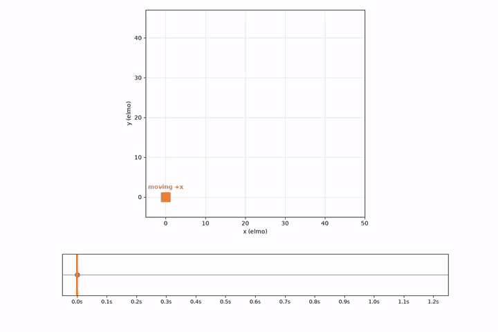

# BAR-Rewind - replay rewind tool for Beyond All Reason
### (Prototype)
Rewind, pause and scrub [Beyond All Reason](https://www.beyondallreason.info/) replays, rendered by BAR itself.

**[Download v0.1.0](https://github.com/LuEklund/BAR-Rewind/releases/tag/v0.1.0)** (Linux and Windows)

### Jump anywhere

Click or drag the timeline and the match is there, at that moment.


### Play backwards

Press R and the fight runs in reverse: shots fly back into the guns and dead units come back.


### Any speed, either way

Up/Down change the speed. At 64x a whole match unwinds in seconds.


## How to use

Needs BAR installed and [Python 3](https://www.python.org/downloads/) (Windows: tick "Add to PATH").

1. Download `bar-rewind-linux.tar.gz` or `bar-rewind-windows.zip` from the
   [release](https://github.com/LuEklund/BAR-Rewind/releases/tag/v0.1.0) and extract it.
2. Run `bar-rewind` (Linux) or `bar-rewind.bat` (Windows). The app opens in your **browser**.
3. Check the **BAR data folder** at the top. It's usually found on its own; if not, paste it and press Enter.
   It's the folder BAR keeps its data in, with `engine/`, `maps/` and `demos/` inside, not the install folder:
   - Linux Flatpak: `~/.var/app/info.beyondallreason.bar/data`
   - Linux AppImage: `~/.local/state/Beyond All Reason`
   - Windows: `%LOCALAPPDATA%\Programs\Beyond-All-Reason\data`
4. Click **Parse** on a replay (a minute or more, depending on its length), then **Play**.

In the player: drag the timeline, Space play/pause, R reverse, Left/Right skip 10 s, Up/Down speed.
The app quits on its own about 90 s after you close its browser tab.

Map previews of `.sd7` maps need [7-Zip](https://www.7-zip.org/) (`7z` on Linux); everything else works without it.

## Build from source (custom install)

Needs [Zig](https://ziglang.org/) 0.16 and Python 3.

```sh
zig build run                    # the app
zig build run -- <replay.sdfz>   # parse (once, cached) and play one replay
zig build test
zig build dist                   # dist/bar-rewind-linux.tar.gz and dist/bar-rewind-windows.zip
```

- `lua/dump_replay.lua`: the BAR widget that records a replay while the headless engine re-simulates it
- `src/bake.zig`, `src/curves.zig`: recording → `.curves` (keyframes thinned with Douglas–Peucker), and
  `bake export-lua`, which writes them in the form the player reads
- `recoil/barrewind.sdd`: the BAR Rewind game (a mutator on top of BAR) that plays `.curves`: the
  `replay_player` gadget and the timeline widget
- `tools/pipeline.py`: parse and play (also a CLI, see its header); `tools/ui.py`: the browser app

## How it works

BAR replays only play forward: a `.sdfz` file is a list of player commands that the engine re-simulates.
bar-rewind runs a replay through the engine once ("parse"), records where everything is, and plays that
recording back inside BAR, where you can drag a timeline, play backwards and change speed.

### What's recorded

The parse keeps only the keyframes playback needs: a key is dropped when interpolating without it stays
within 0.5 [elmo](#whats-recorded "Recoil distance unit: one map grid square is 8 elmos"). What it records:

- **Every unit:** position, facing, health, build progress, on/off, what its weapon aims at, what it builds
- **Aim pieces:** each weapon's barrel and everything it hangs from (torso, turret, arms), so a turret
  points the right way the moment you jump to any time
- **Projectiles**, **features** (wrecks, trees), **terrain changes** and **build queues**

BAR animates the rest itself, from the recorded movement: walk cycles, idle motion, deaths and explosions.

### How keys are picked



1. **Parse:** the engine plays the replay and records every unit every 0.1 s.
2. **Bake:** per unit, start with only the first and last sample as keys.
3. Slide a "playback" unit straight between the two keys at constant speed, and measure how far it is
   from the real unit at each sample's time.
4. Worst gap over 0.5 [elmo](#whats-recorded "Recoil distance unit: one map grid square is 8 elmos"): keep that sample as a key, then repeat on both halves.
   Otherwise drop every sample in between.

Being on the right path isn't enough: a unit that idles and then drives off is late compared to the
straight line, so the moment it starts moving becomes a key.

### Numbers

One 53-minute match (2240 units, 14k projectiles) on a Ryzen 7 5800X:

| | |
|-|-|
| BAR replay (`.sdfz`) | 1.7 MB |
| Parse (once per replay) | 6 min |
| Parsed replay (`.curves`) | 108 MB |


A 16-minute match parses in under a minute, to 12 MB.

## Files it creates

- **Output folder** (default `out/` next to the app; change it at the top of the page): parsed replays
  (`curves/`), map previews, and the logs `curves/dump.log` (parse) and `play.log` (play).
- **Settings**: `bar-rewind.json` in `~/.config/` (Linux) or `%APPDATA%` (Windows), holding the two folders.
- **In BAR's data folder**: `games/barrewind.sdd`, the player BAR loads. Parsing briefly adds
  `LuaUI/Widgets/dump_replay.lua` and removes it again.

If something goes wrong, the page shows the end of the log; the full logs are in the output folder.

## AI disclosure

The code was written by AI. I guided it: Provided sources, how to connect ideas, coming up with ideas on how to solve problems, talked it through what to build and how. 
(To save time and provide a tool quickly).

## License

GPL-2.0 (see `LICENSE`), like BAR's own code. Nothing from BAR is included: models, maps and the game
itself are loaded from your BAR install.
